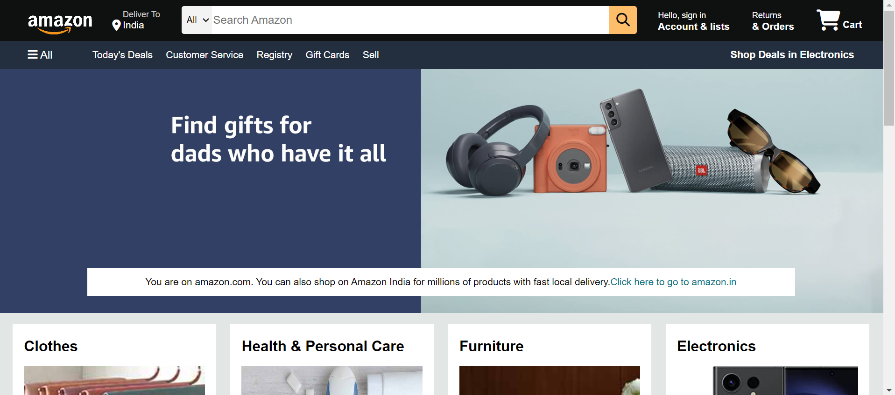
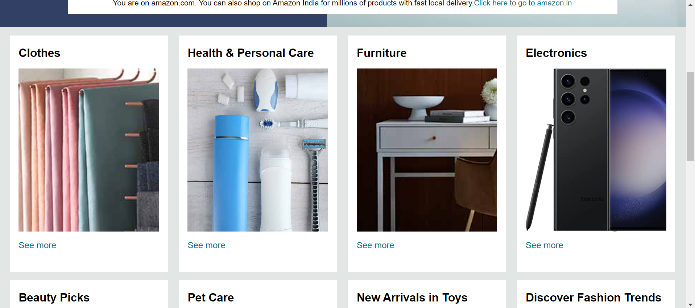
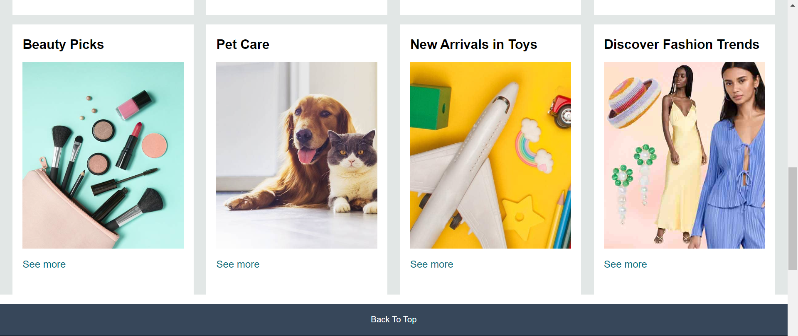
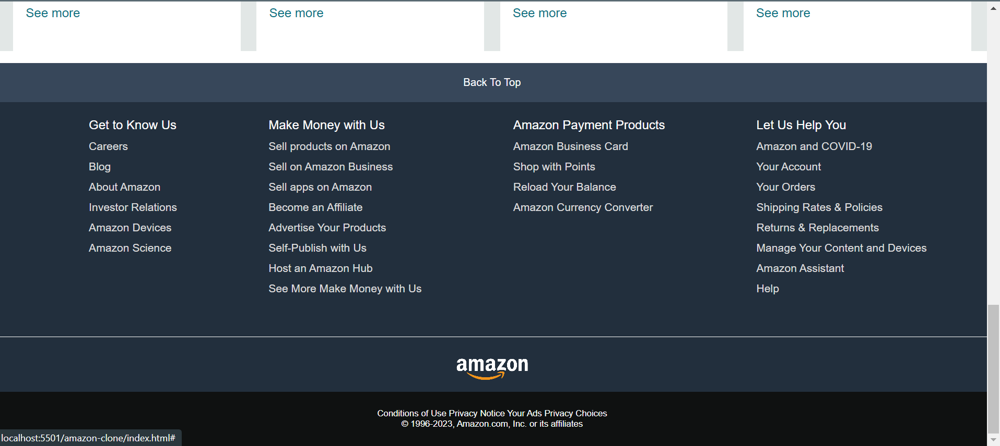

# Amazon Website Clone

This project is a CSS and HTML-only clone of the Amazon website.
Please find demo here : https://btguy-amzn-clone.netlify.app/

## Description

The Amazon Website Clone project aims to replicate the visual appearance of the Amazon website using only CSS and HTML. It demonstrates the use of CSS styles and layouts to create a responsive design resembling the Amazon website.

## Project Structure

The project repository contains the following files and directories:

- `index.html`: The main HTML file that represents the structure of the website.
- `style.css`: The CSS file containing styles for the website layout and design.
- `assets/`: A directory that contains any additional assets used in the project, such as images or icons.

## Getting Started

To view the clone of the Amazon website, follow these steps:

1. Clone the repository: `https://github.com/Biotechnologyguy/amazon-clone`
2. Open the `index.html` file in a web browser.

## Screenshots

